# LLM_onest

LLMの学習・推論実験リポジトリ。HuggingFaceのずんだもんデータセットを使いQwen3.5-2BにLoRA SFTを施し、TransformersとvLLM両方で推論する一連のパイプラインを実装している。

---

## 目的

現代的なLLMの開発フローを**実装を通じて体系的に理解する**ことを目的としている。

具体的には以下の2つの軸で進めた。

**1. 既存モデルの実行・推論**
- `Transformers` を使ったモデルの直接ロードと `generate()` による推論
- `vLLM` を使ったOpenAI互換サーバーの起動とクライアントからのリクエスト
- 同じモデルを2つの推論スタックで動かすことで、それぞれの特性・使い分けを把握する

**2. LoRA × TRL による現代的なファインチューニングの実装**
- `PEFT` の `LoraConfig` でパラメータ効率の良いアダプタ構成を理解する
- `TRL` の `SFTTrainer` で指示チューニング（Supervised Fine-Tuning）の実装フローを学ぶ
- `Weights & Biases` で学習ログを可視化し、実験管理の基本を体験する
- データ取得 → 前処理 → 学習 → 推論の一連パイプラインを自前で組み上げることで、LLMのモデル作成プロセスの一部を実装レベルで理解する

---

## 全体像



---

## ディレクトリ構成

```
LLM_onest/
├── LLM_project/                        # メインプロジェクト（学習 + 推論）
│   ├── training/                       # SFT + LoRAファインチューニング
│   │   ├── src/
│   │   │   ├── pull_data.py            # HuggingFaceからデータセット取得
│   │   │   ├── preprocess.py           # 80/20 split → JSONL変換
│   │   │   └── train_sft.py            # SFTTrainer + LoRA学習メインスクリプト
│   │   ├── configs/
│   │   │   ├── model.yaml              # モデル設定（Qwen3.5-2B）
│   │   │   ├── lora.yaml               # LoRAハイパーパラメータ
│   │   │   └── sft.yaml                # 学習設定（epoch/lr/batch/wandb等）
│   │   ├── data/
│   │   │   ├── raw/                    # 生データ（.gitignore対象）
│   │   │   ├── train.jsonl             # 前処理済み学習データ
│   │   │   └── valid.jsonl             # 前処理済み検証データ
│   │   └── outputs/
│   │       ├── adapters/               # 保存されたLoRAアダプタ重み
│   │       └── checkpoints/            # 学習チェックポイント
│   └── inference/
│       ├── transformers_exp/           # Transformersによる推論
│       │   ├── src/run_inference.py
│       │   └── configs/
│       │       ├── qwen_base.yaml          # ベースモデル推論設定
│       │       └── qwen_zundamon_lora.yaml # LoRAアダプタ適用設定
│       └── vllm_exp/                   # vLLMサーバー経由の推論
│           ├── client/inference.py
│           └── configs/
│               ├── request.yaml        # リクエストパラメータ・プリセット
│               └── server/             # サーバー別設定（qwen / gptoss / lfm）
├── transformers_exp/                   # Transformers推論スタンドアロン実験
└── vllm_exp/                           # vLLM推論スタンドアロン実験
```

> `transformers_exp/` と `vllm_exp/` はルートと `LLM_project/inference/` 配下の2箇所に存在する。構造はほぼ同一で、スタンドアロン実験用とプロジェクト組み込み用の役割分担。

---

## 技術スタック

| カテゴリ | ライブラリ / ツール | バージョン | 用途 |
|----------|---------------------|------------|------|
| **モデル** | Qwen/Qwen3.5-2B | — | ベースLLM |
| **学習** | TRL (SFTTrainer) | >= 0.24.0 | Supervised Fine-Tuning |
| **LoRA** | PEFT | >= 0.17.1 | Parameter-Efficient Fine-Tuning |
| **モデル基盤** | Transformers | git main | モデルロード・トークナイザ |
| **分散学習補助** | Accelerate | >= 1.13.0 | device_map / 混合精度 |
| **推論（直接）** | Transformers + PEFT | — | LoRAアダプタマージ推論 |
| **推論（サーバー）** | vLLM | — | 高速推論・OpenAI互換API |
| **APIクライアント** | OpenAI Python SDK | — | vLLMへのリクエスト |
| **量子化** | bitsandbytes | >= 0.49.2 | 4bit/8bit量子化 |
| **実験管理** | Weights & Biases | >= 0.25.1 | 学習ログ・メトリクス可視化 |
| **データ** | Datasets (HuggingFace) | >= 4.5.0 | データセット取得・処理 |
| **GPU** | PyTorch + CUDA | 2.5.1+cu121 | GPU学習・推論 |
| **Python** | — | >= 3.11, < 3.12 | — |

---

## ずんだもんLoRAファインチューニングパイプライン

### Step 1 — データ取得（`pull_data.py`）

HuggingFace Hub からずんだもんキャラクター対話データセットをダウンロードし、ディスクに保存する。

```python
# alfredplpl/simple-zundamon をローカルに保存
ds = load_dataset("alfredplpl/simple-zundamon")
ds.save_to_disk("data/raw/simple_zundamon")
```

- **データ内容**: ずんだもんのキャラクター設定（正直さ・正確さを重視）に基づいた日本語対話
- **フォーマット**: `messages` フィールドに `role / content` のリスト（ChatML形式）

```bash
uv run src/pull_data.py
```

---

### Step 2 — 前処理（`preprocess.py`）

生データを学習/検証に分割し、TRLが読める JSONL 形式に変換する。

```python
split_ds = train_split.train_test_split(test_size=0.2)
save_jsonl(split_ds["train"], TRAIN_PATH)   # → data/train.jsonl
save_jsonl(split_ds["test"],  VALID_PATH)   # → data/valid.jsonl
```

| ファイル | 役割 | サイズ（目安） |
|----------|------|---------------|
| `data/train.jsonl` | 学習データ（80%） | ~31 KB |
| `data/valid.jsonl` | 検証データ（20%） | ~3 KB |

```bash
uv run src/preprocess.py
```

---

### Step 3 — LoRA SFT学習（`train_sft.py`）

3つのYAMLを読み込んでモデル・LoRA・学習設定を構成し、`SFTTrainer` で学習を実行する。

#### モデル設定（`configs/model.yaml`）

```yaml
model_name: Qwen/Qwen3.5-2B
device_map: auto
torch_dtype: auto
trust_remote_code: true
```

#### LoRA設定（`configs/lora.yaml`）

```yaml
r: 8                     # ランク（低ランク近似の次元数）
lora_alpha: 16           # スケーリング係数（effective_lr ∝ alpha/r = 2.0）
lora_dropout: 0.05       # 過学習防止のDropout
bias: none               # バイアス項は学習しない
task_type: CAUSAL_LM     # 因果言語モデル用
target_modules: all-linear  # Q/K/V/O + FFN の全線形層に適用
```

| パラメータ | 意味 | 今回の値 |
|-----------|------|---------|
| `r` | ランク。小さいほど更新パラメータ数が少ない | 8 |
| `lora_alpha` | スケーリング。`alpha/r` の比率が実効スケールになる | 16（比率2倍） |
| `lora_dropout` | アダプタ層のDropout | 0.05 |
| `target_modules` | LoRAを挿入する層 | 全線形層 |

#### 学習設定（`configs/sft.yaml`）

```yaml
output_dir: outputs/adapters
num_train_epochs: 2
per_device_train_batch_size: 2
gradient_accumulation_steps: 4      # 実効バッチサイズ = 2 × 4 = 8
learning_rate: 0.0002
lr_scheduler_type: cosine
warmup_ratio: 0.1
eval_strategy: steps
eval_steps: 10
fp16: true
report_to: wandb
run_name: zundamon-sft
max_seq_length: 1024
```

#### 学習コードの流れ

```python
# 1. YAML 3種を読み込み
configs = load_configs()   # model.yaml / lora.yaml / sft.yaml

# 2. データセット読み込み
train_dataset = load_dataset("json", data_files="data/train.jsonl")["train"]
valid_dataset = load_dataset("json", data_files="data/valid.jsonl")["train"]

# 3. モデル初期化
model = AutoModelForCausalLM.from_pretrained(model_name, device_map="auto", ...)

# 4. LoRA設定
peft_config = LoraConfig(r=8, lora_alpha=16, target_modules="all-linear", ...)

# 5. W&B初期化
wandb.init(project="llm_project", name="zundamon-sft", config={...全設定...})

# 6. SFTTrainer で学習
trainer = SFTTrainer(model, args, train_dataset, eval_dataset, peft_config)
trainer.train()
trainer.save_model("outputs/adapters")   # LoRAアダプタ重みのみ保存
```

```bash
uv run src/train_sft.py
```

---

### Step 4 — W&B 実験ログ確認

学習中・学習後に以下のメトリクスが Weights & Biases に自動記録される。

| メトリクス | 説明 |
|-----------|------|
| `train/loss` | 学習損失（ステップごと） |
| `eval/loss` | 検証損失（10ステップごと） |
| `train/learning_rate` | cosineスケジューラによるLR変化 |
| `train/epoch` | 現在のエポック進捗 |
| config snapshot | model/lora/sft の全設定を自動記録 |

- **プロジェクト名**: `llm_project`
- **run名**: `zundamon-sft`
- W&Bダッシュボードで train/eval loss曲線・LRスケジュール・ハイパーパラメータを確認できる

---

## TransformersとvLLMの使い分け

### Transformers推論（`transformers_exp/`）

LoRAアダプタをベースモデルにマージして直接 `generate()` を呼ぶ。

```python
model = AutoModelForCausalLM.from_pretrained("Qwen/Qwen3.5-2B", device_map="auto")

# アダプタパスが設定されていればLoRAをマージ
if adapter_path:
    model = PeftModel.from_pretrained(model, adapter_path)

model.eval()
inputs = tokenizer.apply_chat_template(messages, return_tensors="pt")
output = model.generate(**inputs, max_new_tokens=256, do_sample=False)
```

- **設定の切り替え**: `configs/qwen_base.yaml`（LoRAなし）/ `configs/qwen_zundamon_lora.yaml`（LoRAあり）で制御
- `adapter.path: null` でベースモデルのみ推論、パス指定でLoRAマージ推論に切り替わる

---

### vLLM推論（`vllm_exp/`）

vLLMサーバーをOpenAI互換APIとして起動し、クライアントからリクエストを送る。

```python
client = OpenAI(base_url="http://127.0.0.1:8000/v1", api_key="dummy")
response = client.chat.completions.create(
    model=model_name,
    messages=[{"role": "user", "content": prompt}],
    temperature=0.7,
    max_tokens=1024,
    extra_body={"chat_template_kwargs": {"enable_thinking": True}},  # Reasoning出力
)
```

- **プリセット管理**: `configs/request.yaml` で `baseline / temp_low / temp_high / long_output` を切り替え
- **Thinking機能**: `enable_thinking: true` で Qwen3 の思考プロセスを出力
- **出力ファイル**: `outputs/{model_key}_{preset}.txt`（設定情報も含めて保存）

---

### 使い分けの指針

| 比較軸 | Transformers | vLLM |
|--------|-------------|------|
| **LoRAアダプタ適用** | PeftModelで直接マージ | サーバー起動時オプションで指定 |
| **スループット** | 低（逐次処理） | 高（Continuous Batching） |
| **Reasoning / Thinking** | 非対応 | qwen3 reasoning parser対応 |
| **セットアップ** | シンプル（スクリプト1本） | サーバー起動が必要 |
| **生成の制御性** | 高（generate引数を直接制御） | APIパラメータ経由 |
| **主な用途** | 実験・デバッグ・LoRA検証 | サービング・ベンチマーク・Reasoning |

---

## 実行環境

### GPU環境について

本リポジトリの学習・推論はすべて **GPU必須**。ローカルGPUがない場合は **[vast.ai](https://vast.ai/)** などのクラウドGPUサービスを利用する。

> **推奨**: vast.ai で CUDA 12.1 対応インスタンス（RTX 3090 / 4090 / A100 等）を借りて実行する。

---

### GPU動作確認（nvidia-smi）

環境セットアップ後・学習開始前に必ずGPUが認識されているかを確認する。

```bash
nvidia-smi
```

**正常な出力例:**

```
+-----------------------------------------------------------------------------------------+
| NVIDIA-SMI 550.x.x     Driver Version: 550.x.x     CUDA Version: 12.1                 |
|-----------------------------------------+------------------------+----------------------+
| GPU  Name                Persistence-M | Bus-Id          Disp.A | Volatile Uncorr. ECC |
| Fan  Temp   Perf          Pwr:Usage/Cap |           Memory-Usage | GPU-Util  Compute M. |
|=========================================+========================+======================|
|   0  NVIDIA GeForce RTX 4090       Off |   00000000:01:00.0 Off |                  Off |
|  0%   35C    P8             20W / 450W |       1MiB / 24564MiB |      0%      Default |
+-----------------------------------------------------------------------------------------+
```

**確認すべきポイント:**

| 項目 | 確認内容 |
|------|---------|
| `CUDA Version` | 12.1 以上であること |
| `Memory-Usage` | 学習前は空き容量が十分あること（Qwen3.5-2B + LoRA で 約10〜16GB必要） |
| `GPU-Util` | 学習中は高い値（80〜100%）になること |
| GPU名 | 想定したインスタンスのGPUが表示されているか |

**PyTorchからGPUが見えているかの確認:**

```bash
uv run python -c "import torch; print(torch.cuda.is_available()); print(torch.cuda.get_device_name(0))"
```

`True` と GPU名が表示されれば正常。`False` の場合は CUDA ドライバ・PyTorchのバージョンの不一致を疑う。

---

### vast.ai での実行フロー

```
1. vast.ai でインスタンスを選択
   - CUDA 12.1 対応・VRAM 16GB以上を推奨
   - PyTorch 2.5.1+cu121 がプリインストールされたテンプレートを選ぶと楽

2. SSH接続後、nvidia-smi で GPU確認

3. リポジトリをクローン
   git clone <this-repo> && cd LLM_onest/LLM_project/training

4. 依存ライブラリのインストール
   uv sync

5. W&B ログイン（初回のみ）
   wandb login

6. 学習実行（下記クイックスタート参照）
```

---

## クイックスタート

### 学習パイプライン

```bash
cd LLM_project/training

# Step 1: データ取得
uv run src/pull_data.py

# Step 2: 前処理（train/valid分割 → JSONL）
uv run src/preprocess.py

# Step 3: LoRA SFT学習（W&Bログ自動送信）
uv run src/train_sft.py
```

### Transformers推論

```bash
cd LLM_project/inference/transformers_exp

# ベースモデルのみで推論
uv run src/run_inference.py  # qwen_base.yaml を使用

# LoRAアダプタ適用で推論（configs/qwen_zundamon_lora.yaml にパス設定が必要）
uv run src/run_inference.py
```

### vLLM推論

```bash
# ターミナル1: サーバー起動
vllm serve Qwen/Qwen3.5-2B --port 8000 --reasoning-parser qwen3

# ターミナル2: クライアントからリクエスト
cd LLM_project/inference/vllm_exp
uv run client/inference.py
```

